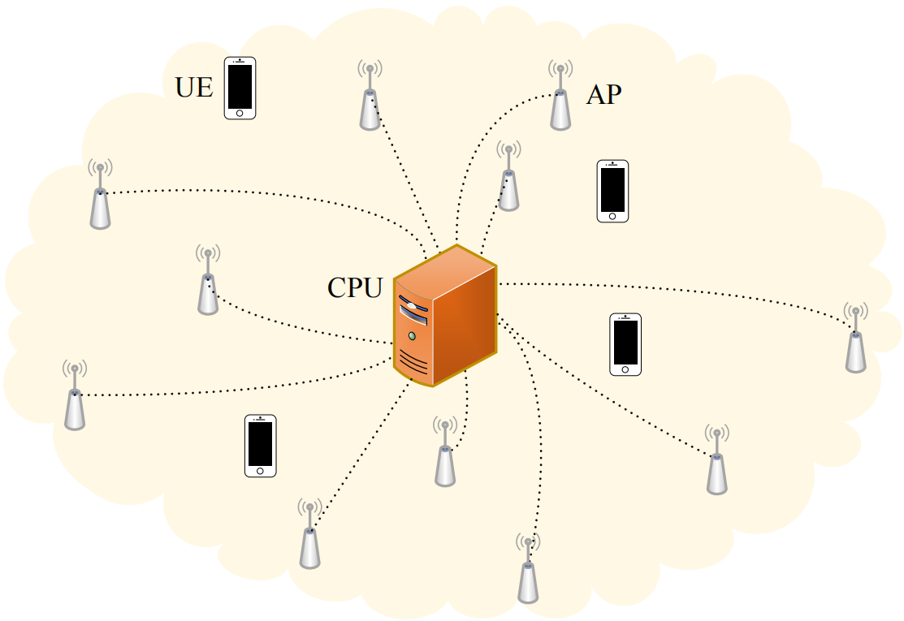
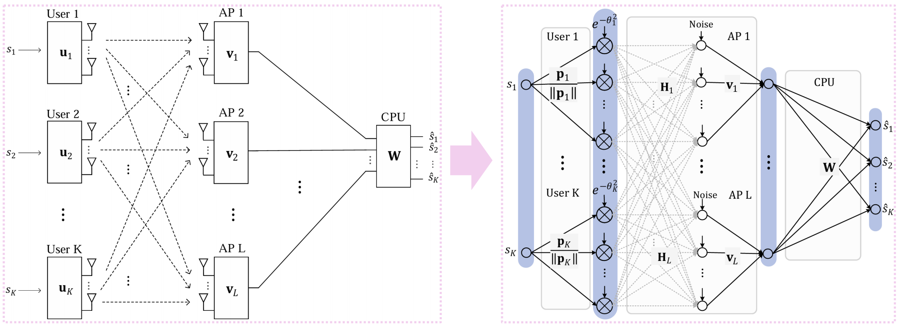
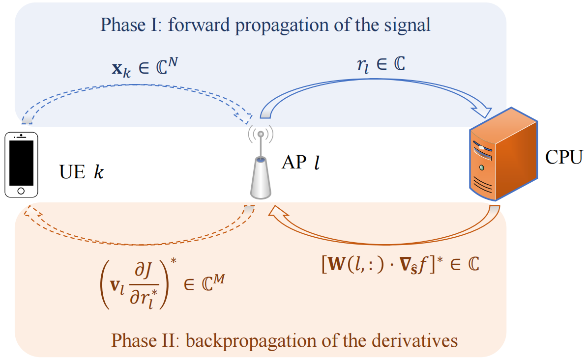
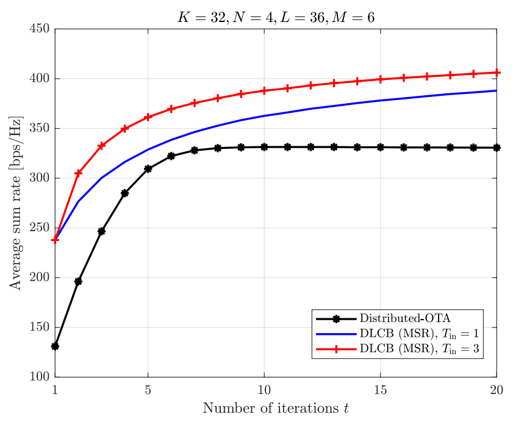
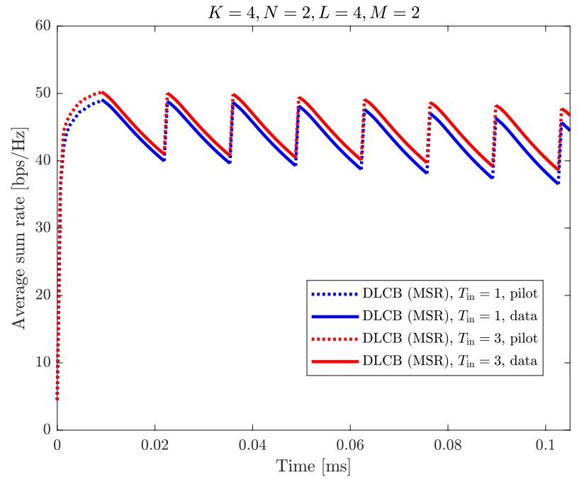

# DLCB: Distributed Learning for Uplink Cell-Free Massive MIMO Networks (IEEE TCOM 2023)

[Paper](https://ieeexplore.ieee.org/document/10159406) 
<!-- | [Poster](https://github.com/AI4Science-WestlakeU/cindm/blob/main/assets/CinDM_poster.pdf)  -->
<!-- | [Tweet](https://twitter.com/tailin_wu/status/1747259448635367756)  -->

Official repo for the paper [Distributed Learning for Uplink Cell-Free Massive MIMO Networks](https://ieeexplore.ieee.org/document/10159406).<br />
[Rui Wang](https://ruiwangdt.github.io/), Weijie Dai, [Yi Jiang](https://scholar.google.com/citations?user=D0YVu3oAAAAJ&hl=zh-CN)<br />
IEEE Transactions on Communications, vol. 71, no. 9, pp. 5595-5606, Sept. 2023<br />
DOI: 10.1109/TCOMM.2023.3288578

## Overview
We propose a <ins>D</ins>istributed <ins>L</ins>earning scheme for uplink <ins>C</ins>ell-free massive MIMO <ins>B</ins>eamforming (**DLCB**) using a quasi-neural network approach. The scheme achieves multi-AP cooperation without explicit channel state information (CSI) estimation, demonstrating significant improvements in communication efficiency and computational complexity compared to state-of-the-art approaches.

#### Key Features
- **Reduced Fronthaul Load**: DLCB compresses vector signals to scalars at each AP before fronthaul transmission, achieving only 1/K of the fronthaul load compared to Distributed-OTA [28].
- **CSI-Free Operation**: DLCB optimizes beamforming weights for UEs, APs, and the CPU using only pilot sequences and limited scalar feedback, eliminating the need for explicit CSI estimation or exchange.
- **Fully Distributed Architecture**: Updates are performed through forward signal propagation and backward scalar derivative propagation. Each node operates using only local information and minimal feedback signals.
- **Linear Computational Complexity**: DLCB requires only O(N) and O(M) multiplications for UEs and APs respectively, compared to O(N³) and O(M³) for competing methods.
- **Flexible Optimization Objectives**: The framework supports various criteria including MMSE and Maximum Sum Rate (MSR) with simple derivative modifications while maintaining the same algorithmic structure.

#### Network Model
- K User Equipments (UEs): Each with N transmit antennas
- L Access Points (APs): Each with M receive antennas and Q outputs
- 1 Central Processing Unit (CPU): With L×Q inputs and K outputs
<p align="center">
  
</p>

#### DLCB Algorithm
The DLCB algorithm models the cell-free massive MIMO network as a quasi-neural network:

<p align="center">
  
</p>

The DLCB operates in two phases:
<p align="center">
  
</p>

## Getting Started
#### Quick Start
To reproduce the results from Figure 10 of our paper, simply run:
```
repro_fig10/fig10_code.m
```

#### Core Implementation
The main DLCB algorithm is implemented in ```repro_fig10/dlcb_alg.m```, which supports the full generalized architecture:
```
% System Configuration:
% - UEs:  K users, each with N transmit antennas and power constraint
% - APs:  L access points, each with M receive antennas and Q outputs  
% - CPU:  Single CPU with L*Q inputs and K outputs
% - $T_{in}$: Number of fronthaul iterations per OTA training round
```

## Performance Results
Convergence Analysis:
<p align="center">
  
</p>

Time-Varying Channel Performance:
<p align="center">
  
</p>

## Repository Structure
```
dlcb/
├── assets/                             # Figures and visualizations
├── repro_fig10/                        # Reproduction of Figure 10 (MATLAB code + .fig)
│   ├── dlcb_alg.m                      # DLCB algorithm
│   ├── fig10_code.m                    # Script for Figure 10
│   ├── uplink_sinr_rate_byEq_ApQout.m  # Rate evaluation
│   └── fig10.fig
├── LICENSE
└── README.md
```

## Citation
If you find our work and/or our code useful, please cite us via:

```bibtex
@article{wang2023distributed,
  title={Distributed learning for uplink cell-free massive MIMO networks},
  author={Wang, Rui and Dai, Weijie and Jiang, Yi},
  journal={IEEE Transactions on Communications},
  volume={71},
  number={9},
  pages={5595--5606},
  year={2023},
  publisher={IEEE}
}
```

